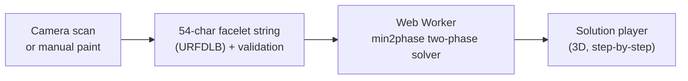

<div align="center">

# 🧊 Rubik's Cube Solver

**Scan your cube with a webcam (or paint it by hand) and get a short solution in milliseconds, entirely in your browser.**

[](https://MahendraVarmaB.github.io/RubiksCubeSolver)


</div>

---

## ✨ Overview

Rubik's Cube Solver is a fully client-side web app that takes the state of a 3×3 cube and returns a move-by-move solution. There is **no server and no API**: the solver runs locally in a Web Worker, so it works offline once loaded and your camera frames never leave your device.

The core solver is a **TypeScript port of the [min2phase](https://github.com/cs0x7f/min2phase) two-phase algorithm**, the same family of algorithm used by fast software solvers. Solutions typically come back in **≤ 21 moves** and in well under a second once the lookup tables are built.

## 🚀 Features

- **📷 Webcam scanning:** Point your camera at each face, press capture, and colors are classified automatically using an HSL-based detector. Any face can be re-scanned individually.
- **🎨 Manual input:** Paint stickers on an interactive 3D cube you can drag to rotate. Live color counts (`9/9` per color) and validation errors help you catch mistakes.
- **▶️ Step-through solution player:** Watch the solution on a 3D cube with Prev / Next controls, click-to-jump on any move, and a *slow-motion* auto-play mode with rotation arrows on the active face.
- **🧠 Runs in a Web Worker:** Table generation and solving happen off the main thread, so the UI stays responsive, with a progress bar during first load.
- **💾 Cached lookup tables:** Precomputed tables are stored in `localStorage`, so return visits skip the initialization step.
- **✅ Solvability checks:** Detects invalid cubes and explains why (wrong color counts, flipped edge, twisted corner, parity error) instead of failing silently.
- **🔁 Import / export:** Copy any cube state as a 54-character facelet string and paste one back in to restore it.
- **📱 Mobile friendly:** Uses the rear camera by default on phones.

## 🧩 How It Works



1. **Input:** Colors come from either the webcam scanner or the manual painter.
2. **Color detection:** Each sticker is sampled (a 5×5 pixel average at the center of every grid cell), converted from RGB to HSL, and classified into one of six cube colors using hue / saturation / lightness thresholds.
3. **Facelet string:** The center sticker of each face defines that face's color, so **the scan works with any cube color scheme**, not just the standard one. The result is a 54-character `URFDLB` string.
4. **Validation:** Sticker counts, edge/corner permutations, flip, twist, and parity are verified before solving.
5. **Solving:** The two-phase algorithm uses IDA\* search with symmetry-reduced coordinates and pruning tables. Phase 1 reduces the cube into a subgroup; Phase 2 finishes the solve.
6. **Playback:** Each move is applied to a cubie-level model of the cube to render every intermediate state.

## 🛠️ Tech Stack

| Area | Tools |
| --- | --- |
| UI | React 18, TypeScript |
| State | Zustand |
| Build | Vite |
| Solver | Custom TypeScript port of min2phase (IDA\*, symmetry reduction, pruning tables) |
| Concurrency | Web Workers (ES module worker) |
| 3D cube rendering | Pure CSS 3D transforms |
| Camera / vision | `getUserMedia`, Canvas API, HSL color classification |
| Testing | Vitest |
| Deployment | GitHub Pages (`gh-pages`) |

## 📂 Project Structure

```
src/
├── components/
│   ├── CameraScanner.tsx     # Webcam capture + grid overlay
│   ├── CubeNet.tsx           # Unfolded-cube progress view
│   ├── FacePreview.tsx       # Small preview of a scanned face
│   ├── InteractiveCube.tsx   # Draggable 3D cube for painting stickers
│   ├── ManualInput.tsx       # Palette, validation, import/export
│   └── SolutionPlayer.tsx    # Step-through / slow-motion solution viewer
├── lib/
│   ├── solver/               # min2phase port
│   │   ├── search.ts         #   two-phase IDA* search + solveCube()
│   │   ├── coord-cube.ts     #   move & pruning tables
│   │   ├── cubie-cube.ts     #   cubie-level cube model
│   │   └── util.ts
│   ├── color-detection.ts    # RGB→HSL, color classification, facelet builder
│   └── solver-bridge.ts      # Promise-based wrapper around the Worker
├── stores/                   # Zustand stores (scan + manual input)
├── workers/solver-worker.ts  # Web Worker entry point
└── App.tsx                   # Loading → input → solving → result flow
tests/
├── solver.test.ts            # Solver correctness tests
└── color-detection.test.ts   # Color classification tests
```

## 🏁 Getting Started

**Prerequisites:** Node.js 18+ and npm.

```bash
# Clone the repository
git clone https://github.com/MahendraVarmaB/RubiksCubeSolver.git
cd RubiksCubeSolver

# Install dependencies
npm install

# Start the dev server
npm run dev
```

Then open the local URL printed in your terminal. Camera scanning requires `localhost` or HTTPS.

### Available Scripts

| Command | Description |
| --- | --- |
| `npm run dev` | Start the Vite dev server |
| `npm run build` | Type-check and create a production build |
| `npm run preview` | Preview the production build locally |
| `npm test` | Run the Vitest suite |
| `npm run deploy` | Build and publish to GitHub Pages |

## 🧪 Testing

```bash
npm test
```

Tests cover:

- **Solver:** validity checks, the already-solved cube (0 moves), known scrambles solving within 21 moves, and end-to-end verification that *scramble + solution = solved cube*.
- **Color detection:** RGB→HSL conversion, classification of all six colors, and facelet-string construction.

## 📸 Tips for Better Scans

- Use bright, even lighting and avoid strong shadows or glare.
- Fill the grid overlay with the face and keep the cube flat and steady.
- Scan faces in the order shown on screen (U, R, F, D, L, B) with a consistent orientation.
- If a color is misread, click that face in the net view and re-scan it, or switch to **Manual Input** to fix individual stickers.

## 🗺️ Possible Improvements

- Live auto-capture (detect a steady face instead of pressing a button)
- Calibration step to adapt color thresholds to the user's lighting
- Adjustable playback speed in the solution player
- Move notation legend and a beginner-friendly solving mode

## 🙏 Acknowledgements

The solving core is a TypeScript port of [min2phase](https://github.com/cs0x7f/min2phase) by Shuang Chen, built on Herbert Kociemba's two-phase algorithm.

---

<div align="center">

Built by [Mahendra Varma](https://github.com/MahendraVarmaB)

</div>
